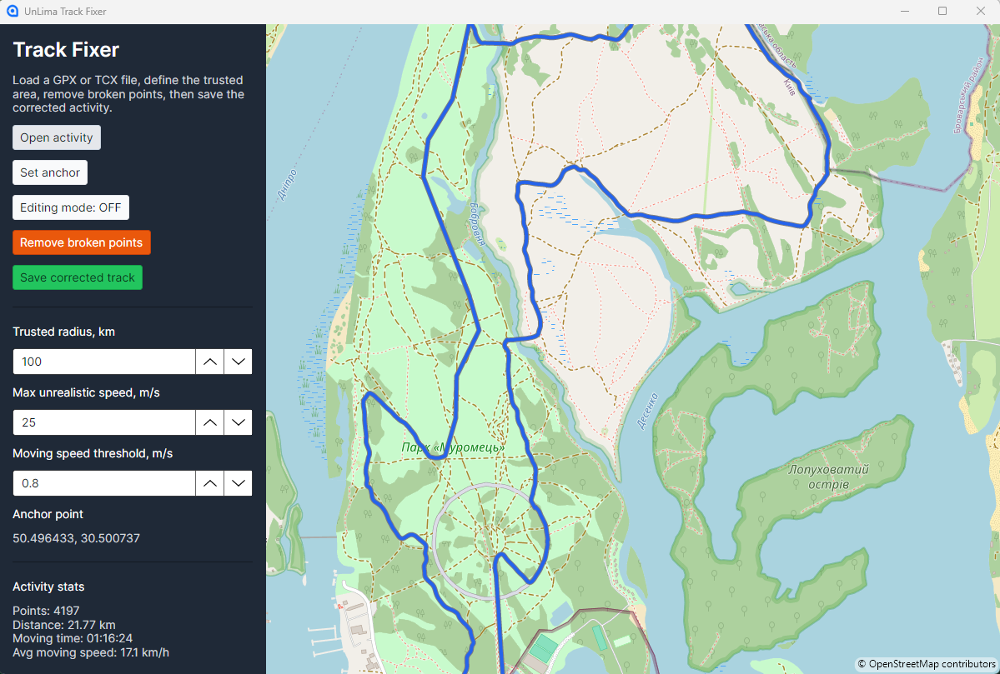

# UnLima Track Fixer

A cross-platform desktop application designed for fixing bike ride activity files containing spoofed, broken, or unrealistic GPS track points.
There are no magic algoritms, program just detect waypoints outside of some trusted radius and deletes it from track. Later it is possible to edit segments to return to more or less real track.

## Main Screen



## Purpose & Functions

- **Multi-Format Activity Support**: Load and save activity files in **GPX**, **TCX**.
- **OpenStreetMap Map Viewer**: Interactive map display powered by Mapsui.
- **Trusted Anchor & Radius**: Define a trusted geographic area using an anchor point and trusted radius (default 100 km) to automatically remove erroneous points outside the area.
- **Unrealistic Speed & Jump Removal**: Detects and cleans up impossible location jumps and consecutive GPS anomalies.
- **Manual Track Editing**:
  - Drag existing track points to new locations.
  - Insert new track points via segment midpoint handles.
  - Real-time route segment redrawing during dragging.
- **Automatic Telemetry Interpolation**: Automatically interpolates timestamps and sensor data (altitude, heart rate, cadence, power, temperature) for inserted points while preserving original timestamps on existing points.
- **Metric Recalculation**: Automatically recalculates point-to-point distances, total distance, moving time, average speed, and moving average speed.
- **Point Inspection**: Right-click any track point in editing mode to inspect its complete telemetry data.

## How to Use

1. **Load Activity File**: Open the application and load your activity file (`.gpx`, `.tcx`).
2. **Review on Map**: Inspect your route displayed on the OpenStreetMap interactive map.
3. **Set Trusted Anchor & Radius**: Set or adjust the anchor point and trusted radius to filter out erroneous or spoofed points.
4. **Remove Broken Points**: Click the remove broken points function to automatically delete points outside the trusted radius and impossible jumps.
5. **Manual Adjustments**: Drag points or insert new points via segment midpoints to refine the route.
6. **Save Corrected Activity**: Save the corrected track back to your desired file format.

## Installation Note

### Prerequisites
- **.NET 8 SDK** (or runtime) installed on your system.
- Supported operating systems: Windows, macOS, Linux (cross-platform Avalonia UI application).

### Required Packages / Dependencies
The project relies on NuGet packages specified in the solution, including:
- **Avalonia UI** (v11+) for cross-platform desktop UI rendering.
- **Mapsui** for OpenStreetMap integration.

### Build and Run Instructions
1. Clone the repository and navigate to the project root directory.
2. Restore dependencies and build the solution:
   ```bash
   dotnet build UnLimaMyTrack.sln -c Release
   ```
3. Run the application:
   ```bash
   dotnet run --project UnLimaMyTrack.TrackFixer/UnLimaMyTrack.TrackFixer.csproj
   ```

## TBD
- Proper FIT file support.
- File type conversion.

## Note
*This application was written by AI with limited testing. So, it is not guaranted that all data is properly reculculated. 
Note recommented to use if your track is necessary for prove of your actual ride.*
